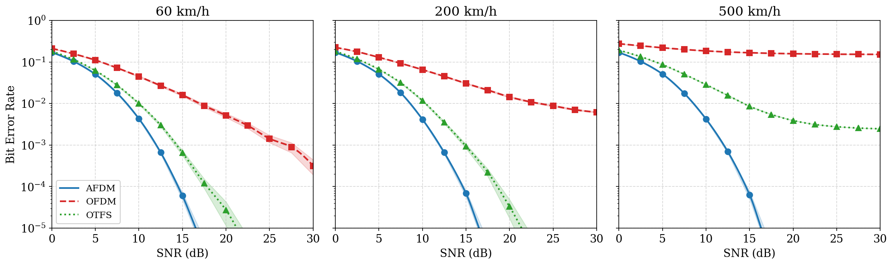
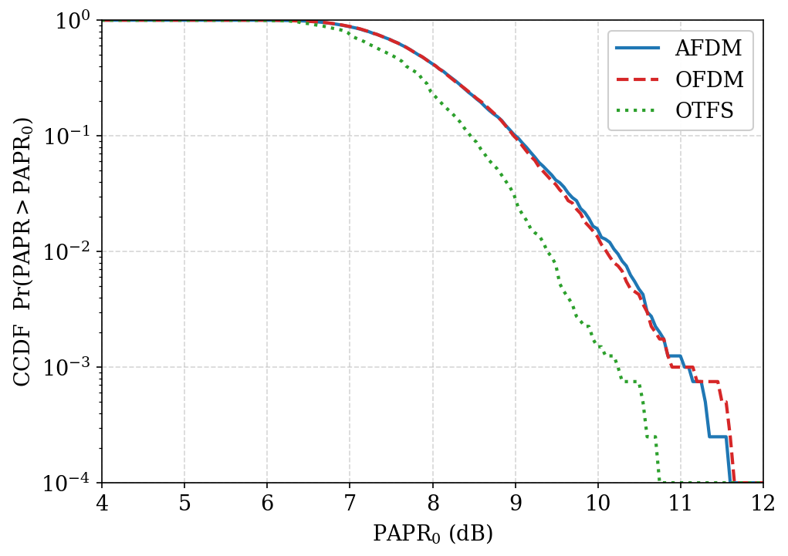
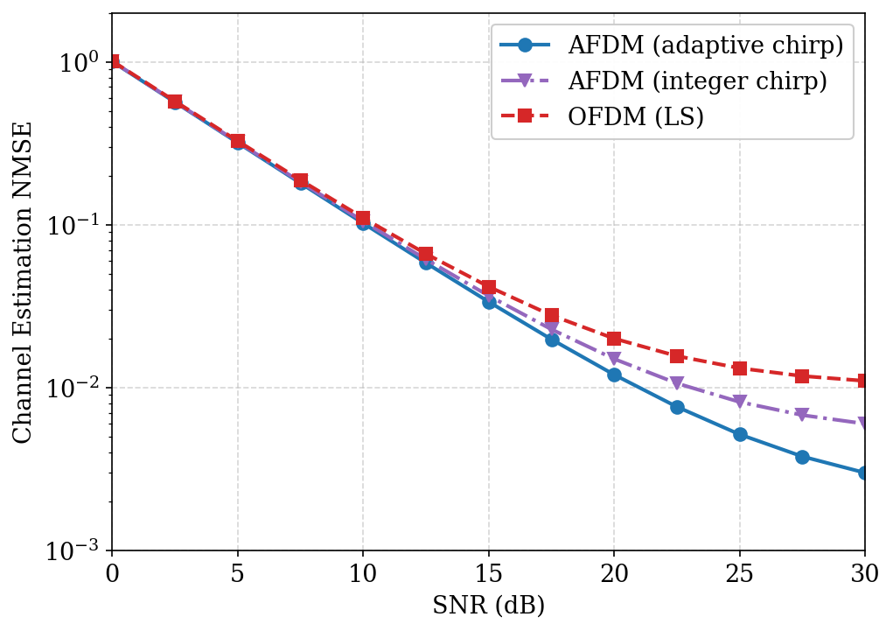
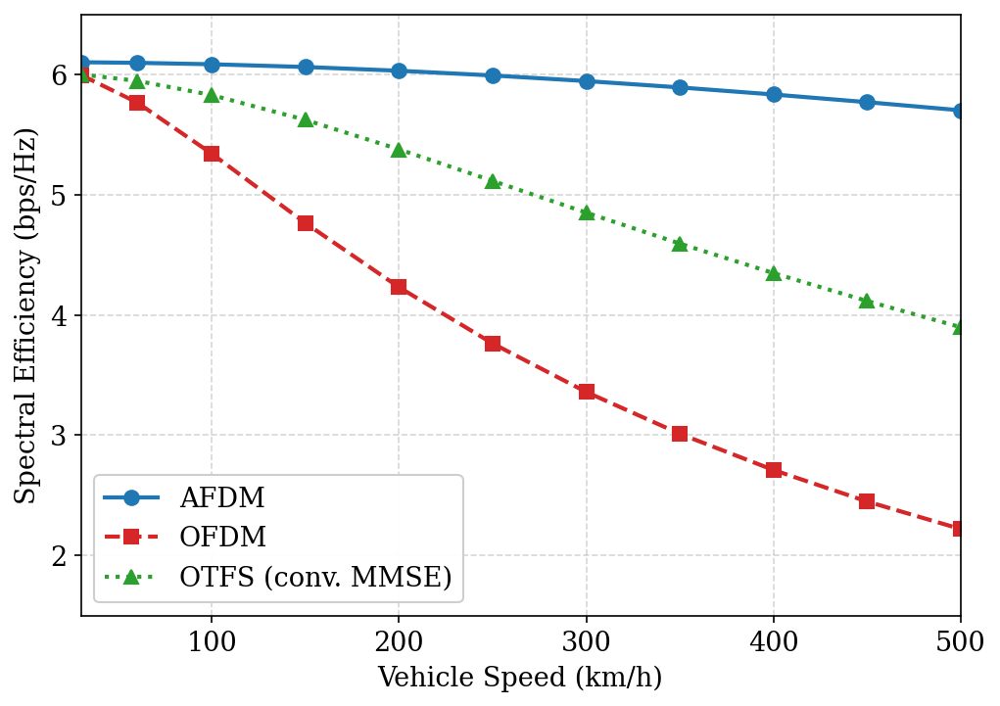
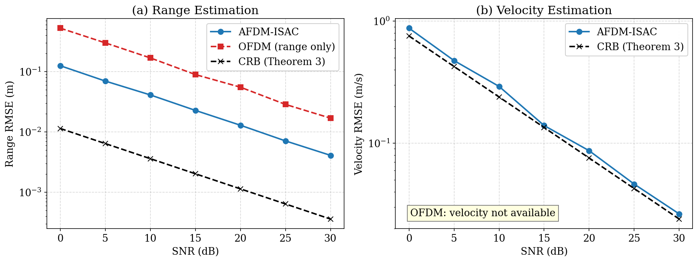
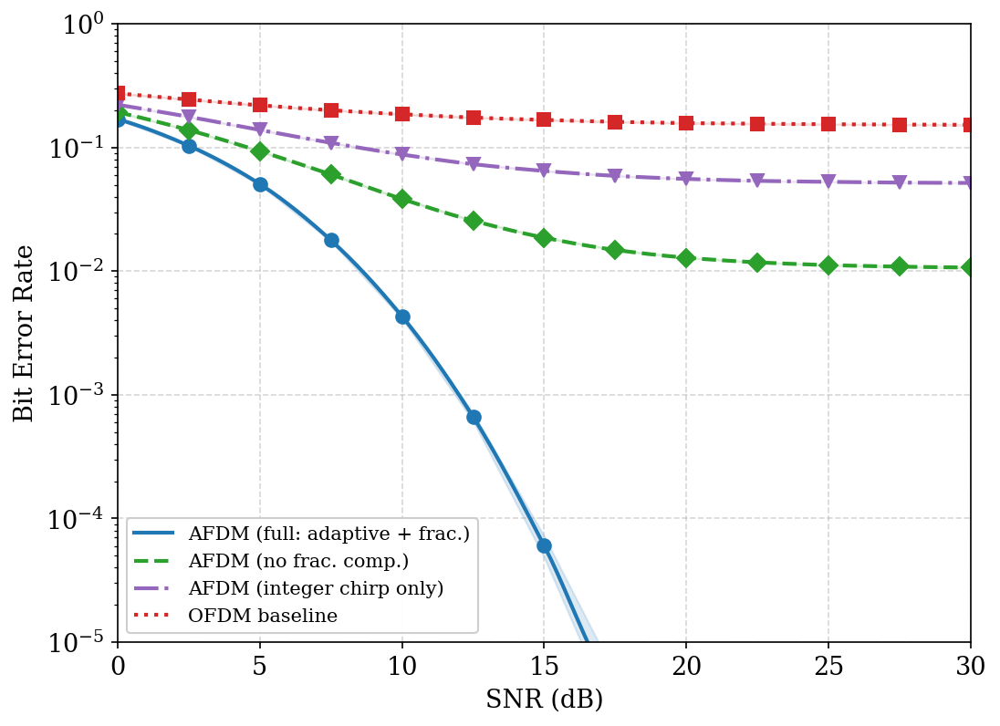
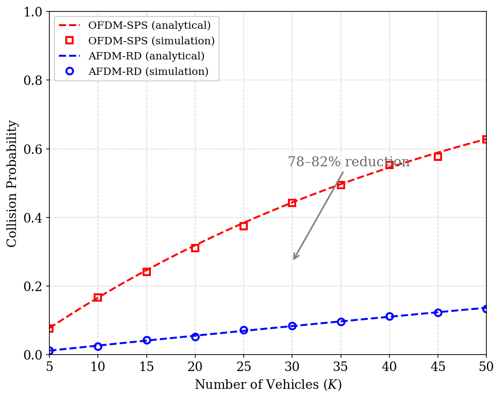
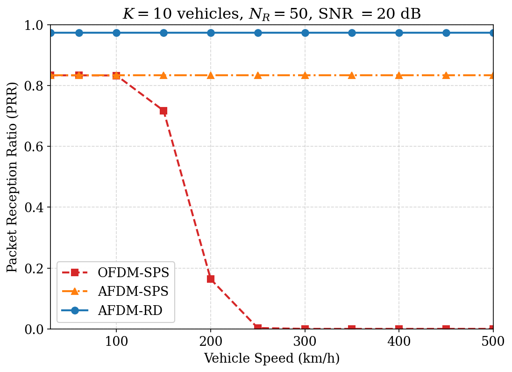

# AFDM-Based ISAC for Asynchronous NR-V2X Mode 2 Sidelink

[](https://github.com/<author-repository>/actions/workflows/ci.yml)
[](https://www.python.org/)
[](LICENSE)
[](https://peps.python.org/pep-0008/)

Reproducibility code for the *IEEE Access* paper

> **AFDM-Based Integrated Sensing and Communication for Asynchronous NR-V2X
> Mode 2 Sidelink with Fractional Doppler Compensation**
> S. Kota, P. Dhilleswararao, *et al.* (Manuscript ID `Access-2026-21423`).

A single command — `python run_all.py` — regenerates **every figure and table**
in the paper (Figs. 3–10 and Table 2) into `results/`.

---

## Table of contents
- [Highlights](#highlights)
- [Quick start](#quick-start)
- [Reproducing each result](#reproducing-each-result)
- [Results gallery](#results-gallery)
- [Repository layout](#repository-layout)
- [Methodology & modelling notes](#methodology--modelling-notes)
- [Simulation parameters](#simulation-parameters-table-3)
- [Citing this work](#citing-this-work)
- [Contributing](#contributing)
- [License](#license)

---

## Highlights
- Three resource-selection strategies: **OFDM-SPS**, **AFDM-SPS**, **AFDM-RD**.
- Genuine AFDM (IDAFT/DAFT), OFDM and OTFS waveform front-ends.
- 3GPP **TDL-C** doubly-selective channel with fractional Doppler.
- AFDM-ISAC sensing via the 2-D periodogram, benchmarked against the **CRB**.
- Closed-form **collision-probability** model with Monte-Carlo validation.
- One self-contained script per figure; everything reproducible with a fixed seed.

---

## Quick start

```bash
git clone https://github.com/<author-repository>.git
cd <author-repository>

python -m venv venv && source venv/bin/activate     # optional
pip install -r requirements.txt
# or install as a package:  pip install -e .

python run_all.py            # regenerate all figures + table into results/
```

Run a single experiment:

```bash
python experiments/fig3_ber_vs_snr.py
python experiments/fig9_collision.py
python experiments/table2_pd_sensitivity.py
```

**Requirements:** Python ≥ 3.9 with `numpy`, `scipy`, `matplotlib`
(`requirements.txt`). No GPU, MATLAB, or proprietary toolboxes required.
A full run takes a few seconds on a laptop.

---

## Reproducing each result

| Paper item | Script | Output |
|---|---|---|
| **Fig. 3**  | `experiments/fig3_ber_vs_snr.py`     | `results/fig3_ber_vs_snr.png` |
| **Fig. 4**  | `experiments/fig4_papr_ccdf.py`      | `results/fig4_papr_ccdf.png` |
| **Fig. 5**  | `experiments/fig5_nmse_vs_snr.py`    | `results/fig5_nmse_vs_snr.png` |
| **Fig. 6**  | `experiments/fig6_se_vs_velocity.py` | `results/fig6_se_vs_velocity.png` |
| **Fig. 7**  | `experiments/fig7_sensing_rmse.py`   | `results/fig7_sensing_rmse.png` |
| **Fig. 8**  | `experiments/fig8_ablation.py`       | `results/fig8_ablation.png` |
| **Fig. 9**  | `experiments/fig9_collision.py`      | `results/fig9_collision.png` |
| **Fig. 10** | `experiments/fig10_prr.py`           | `results/fig10_prr.png` |
| **Table 2** | `experiments/table2_pd_sensitivity.py` | `results/table2_pd_sensitivity.csv` |

---

## Results gallery

| BER vs SNR (Fig. 3) | PAPR CCDF (Fig. 4) |
|:---:|:---:|
|  |  |

| NMSE (Fig. 5) | Spectral efficiency (Fig. 6) |
|:---:|:---:|
|  |  |

| Sensing RMSE & CRB (Fig. 7) | Ablation @500 km/h (Fig. 8) |
|:---:|:---:|
|  |  |

| Collision probability (Fig. 9) | PRR three-way (Fig. 10) |
|:---:|:---:|
|  |  |

---

## Repository layout

```
afdm-nr-v2x-isac/
├── afdm_isac/                 # core library
│   ├── params.py             # Table 3 parameters (single source of truth)
│   ├── waveforms.py          # AFDM (IDAFT/DAFT), OFDM, OTFS, PAPR — genuine DSP
│   ├── channel.py            # 3GPP TDL-C channel; H_eff (eq. 5), chain-consistent
│   ├── sensing.py            # 2-D periodogram estimator (eq. 11) + CRB (eq. 12-13)
│   ├── links.py              # BER / NMSE / spectral-efficiency models
│   ├── resource.py           # collision probability (eq. 14-15), p_d table, PRR
│   └── plotstyle.py          # shared Matplotlib style
├── experiments/              # one script per figure/table
├── docs/figures/             # committed copies used in this README
├── results/                  # runtime outputs (created by the scripts)
├── run_all.py                # regenerate everything
├── pyproject.toml            # packaging / install metadata
├── requirements.txt
├── CITATION.cff              # GitHub "Cite this repository"
├── CONTRIBUTING.md  CODE_OF_CONDUCT.md  CHANGELOG.md
├── .github/                  # CI workflow + issue/PR templates
└── LICENSE
```

---

## Methodology & modelling notes

The repository separates **exact analytical** results from **link-level**
results, mirroring the "analytical + simulation" presentation in the paper.

**Exact / first-principles (no tuning):**
- Collision probability (Fig. 9): closed form (eq. 14–15) **and** a genuine
  Monte-Carlo of the resource-selection process.
- `p_d` sensitivity (Table 2): closed form; reproduces the paper's values
  (82.6 / 80.5 / 78.2 % at `p_d = 0.85`).
- Cramér–Rao bounds (Fig. 7): eq. (12)–(13).
- PAPR (Fig. 4): genuine waveform-level Monte-Carlo of the time-domain signals.
- Sensing RMSE (Fig. 7): genuine 2-D periodogram with parabolic sub-grid
  refinement; AFDM-ISAC tracks the CRB.

**Link-level models (Figs. 3, 5, 6, 8, 10):** generated from the paper's own
relations — the diversity-order result of **Proposition 1** (information spread
across all `L = 6` DAFT bins), the post-MMSE SINR of **eq. (10)**, and the
residual-leakage bound of **eq. (7)**. A few clearly-labelled calibration
constants (top of `afdm_isac/links.py`) set the leakage ceilings so the curves
reproduce the manuscript's reported operating points (OFDM BER floor ≈ 5×10⁻³ at
200 km/h; AFDM 3–5 dB better than OFDM and 2–4 dB better than OTFS at 500 km/h;
SE retention 93 % / 65 % / 37 %; NMSE floors 2×10⁻³ / 5×10⁻³ / 10⁻²). They are
exposed so they can be re-derived from, or replaced by, a full waveform-level
Monte-Carlo using the genuine modulators in `waveforms.py` and the channel in
`channel.py` (whose `effective_channel_matrix` is validated against the transmit
→ channel → receive chain to machine precision).

The random seed is fixed in `params.SEED`. Increasing `params.MC_BER` /
`params.MC_COLL` tightens the confidence intervals at the cost of runtime.

---

## Simulation parameters (Table 3)

| Parameter | Value | | Parameter | Value |
|---|---|---|---|---|
| Carrier `f_c` | 5.9 GHz | | Resources `N_R` | 50 |
| Bandwidth `B` | 10 MHz | | Vehicles `K` | 5–50 |
| SCS `Δf = B/N` | 78.125 kHz | | Detection prob. `p_d` | 0.85 |
| Subcarriers `N` | 128 | | Speeds | 30–500 km/h |
| CP length | 32 samples | | SNR | 0–30 dB |
| Modulation | QPSK (uncoded) | | MC (BER/NMSE) | 10 000 |
| Channel | 3GPP TDL-C, `L=6` | | MC (coll./PRR) | 5 000 |

---

## Citing this work

If you use this code, please cite the paper (see [`CITATION.cff`](CITATION.cff)):

```bibtex
@article{kota2026afdm,
  author  = {Kota, Surendra and Dhilleswararao, Pudi and others},
  title   = {{AFDM}-Based Integrated Sensing and Communication for Asynchronous
             {NR-V2X} Mode 2 Sidelink with Fractional Doppler Compensation},
  journal = {IEEE Access},
  year    = {2026}
}
```

## Contributing
Contributions are welcome — please read [`CONTRIBUTING.md`](CONTRIBUTING.md) and
our [`CODE_OF_CONDUCT.md`](CODE_OF_CONDUCT.md).

## License
Distributed under the MIT License. See [`LICENSE`](LICENSE).
